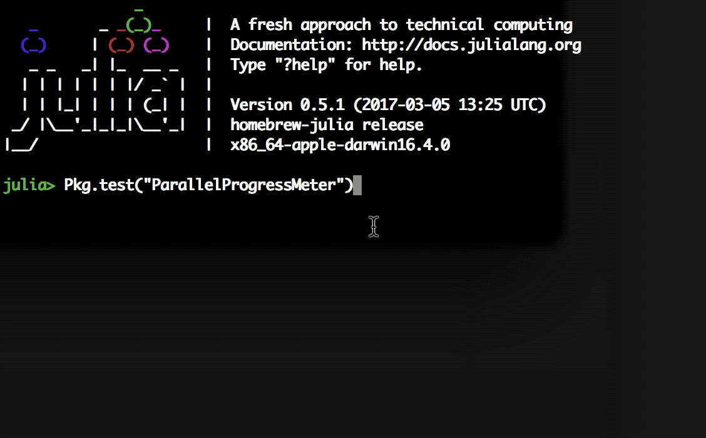

# ParallelProgressMeter

[](https://travis-ci.org/jekyllstein/ParallelProgressMeter.jl) [](https://coveralls.io/github/jekyllstein/ParallelProgressMeter.jl) [](http://codecov.io/github/jekyllstein/ParallelProgressMeter.jl)

Parallel progress meter for long running serial tasks being executed in a parallel for loop in Julia

## Installation

Within julia, execute

```julia
Pkg.clone("https://github.com/jekyllstein/ParallelProgressMeter.jl")
```

## Usage

### Progress for N serial tasks with a pre-determined number of steps for each task

The current implementation only works for @parallel for loops that execute some function
serialTask() with certain required inputs.  A progress percentage will be shown for each 
parallel task running as seen in the gif below:



The script below demonstartes initializing the package, adding workers to julia, defining a 
serial task function, and executing it in parallel with the active progress monitor:

```julia
using ParallelProgressMeter

#add one worker for each parallel task.  The test suite will include
#cases where the number of tasks exceeds the available workers.
numTasks = 4
addprocs(numTasks)

#Note that the function is defined below with an @everything macro tag after 
#the additional workers were added, ensuring it is available on all workers.

#number of times each task will iterate, in this case every task 
#will perform 1e8 iterations
params = round(Int, 1e8)*ones(Int64, numTasks)

#define a generic serial task that will be run in parallel once for each CPU core
#in order to push updates to the progressArray each serial task must have access to
#the remote channel listening for updates as be tagged with it's id in the parallel loop
@everywhere function serialTask(N::Int64, c::RemoteChannel{Channel{Any}}, id, delay::Float64, show = false)
    a = 0.0
    t = time()
    for i = 1:N
        a += rand()
        if show && (((time() - t) > delay) || ((i == N) && (i != 1)))
        
            put!(c, (id, 100*i/N))
            #println(string("Progress = ", round(100*i/N, 2), "%"))
            t  = time()
        end       
    end
    return a
end

#initialize parallel progress monitor and save remote channel
c = initializeProgress(numTasks)

#run parallel for loop with progress meter
@parallel (vcat) for i = 1:numTasks
    serialTask(params[i], c, i, 1.0, true)
end

close(c)
```

## Notes
The initialization function is the only exported part of the package and returns a remote channel which must be passed into
the loop function.  In cases where numTasks exceeds or equals the available workers, you will notice one progress bar remaining
at 0.0% until all other tasks are complete as expected by not having enough workers to launch every task in parallel.  

## Future Plans
The requirements on the serialTask inner function should be streamlined with another exported update!() function that pushes
to the remote channel.  Alternatively, a macro can be defined that automatically initializes the monitor and runs serialTask 
in parallel for a specified number of tasks.  The loop construction should be linked to the initialization because the program
only makes sense if the numTasks is used for both.  A macro could also eliminate the need to close the remote channel created 
by the initializer as it could be created, passed, and closed automatically

Another version of parallelism in which a single parallel loop with a set number of steps is possible but not yet implemented.  That type of 
meter would only have one progress bar like the original package but would work on parallel loops instead of purely serial ones.

## Credits
Structure inspired by the package https://github.com/timholy/ProgressMeter.jl.  Basic parallel functionality created by Jason Eckstein @jekyllstein and Michael Jin @mikhail-j
